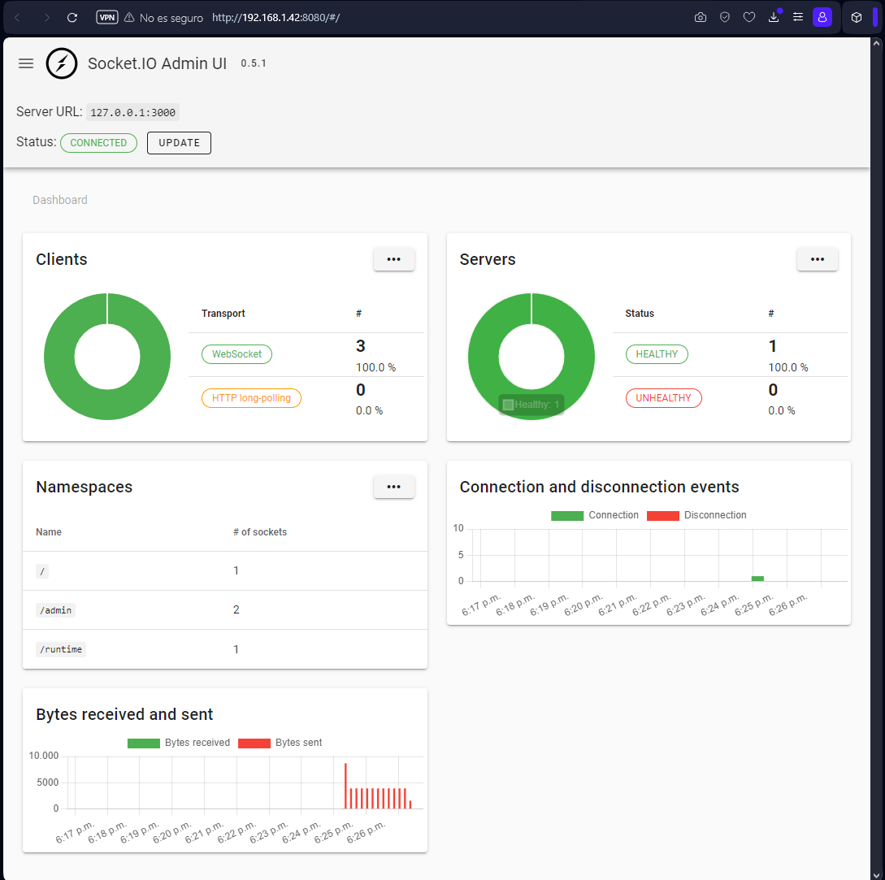
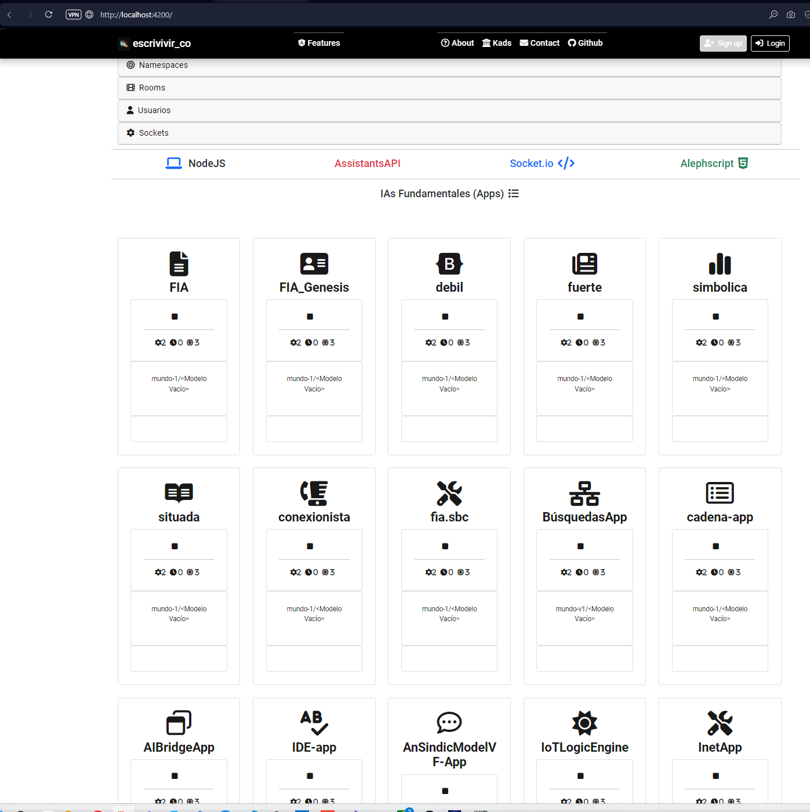
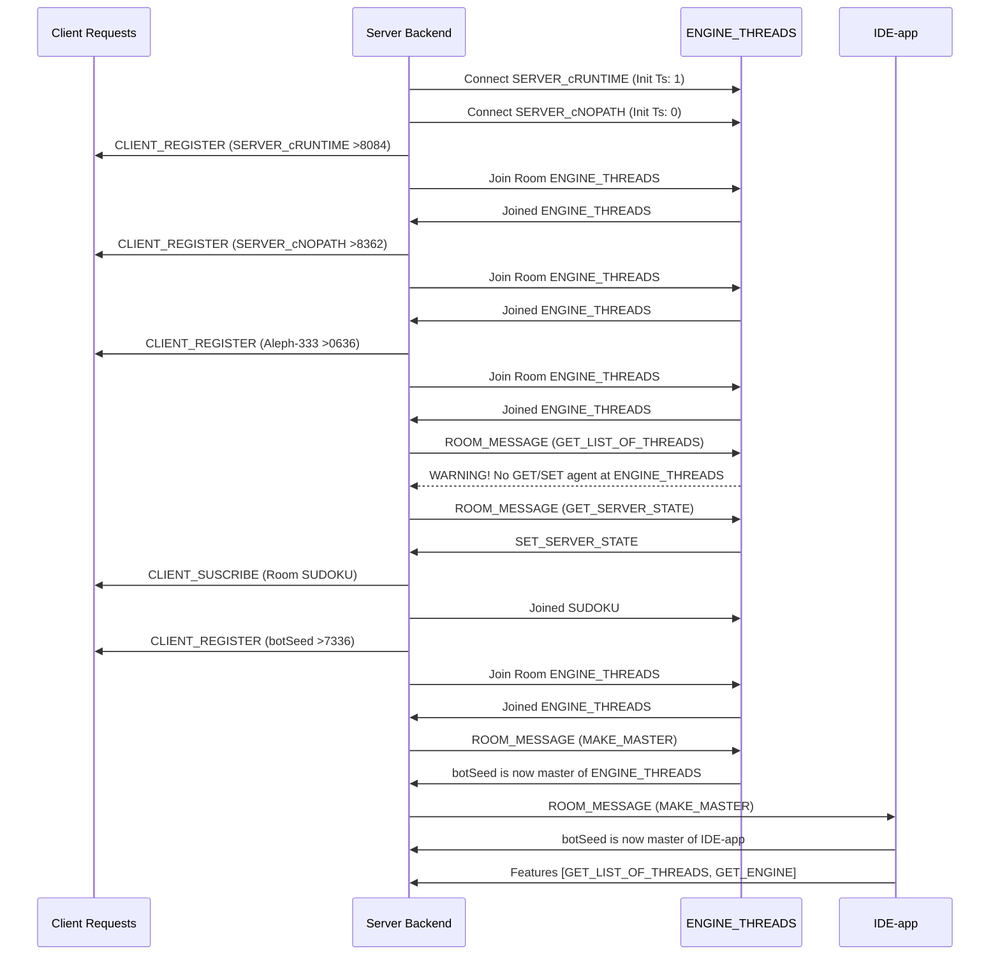

# Alephscript

- Socket.io ws pub/sub server. [ws-server](./ws-server/)
  - sh arrancar_server.sh
- Socket.io Admin UI. [ws-server-ui](./socket.io-admin-ui-develop)
  - sh arrancar_admin.sh
- NodeJS Engine Pool. [alephscript](./alephscript/)
  - sh arrancar_rt.sh
- Angular Engine Admin UI. [webapp](./webapp/)
  - sh arrancar_app.sh


## Ws pub/sub server

```console
secre@ALEPH MINGW64 ../../../../../../ws-server
$ npm run dev

> backend-ta-te-ti@1.0.0 dev
> nodemon --watch "src/**" --ext "ts,json" --ignore "src/**/*.spec.ts" --exec npx tsx src/index.ts

[nodemon] 3.1.3
[nodemon] to restart at any time, enter `rs`
[nodemon] watching path(s): src\**
[nodemon] watching extensions: ts,json
[nodemon] starting `npx tsx src/index.ts`
- AlephServer admin There is now namespaces: 1
- AlephServer runtime There is now namespaces: 2
- AlephServer  There is now namespaces: 3
Server escuchando en el puerto 3000
         -  SERVER_cRUNTIME Conectando al backend... 
         -  SERVER_cNOPATH Conectando al backend...
- AlephServer New connection at runtime. Socket: El socket no se ha registrado: pXVfvN4hyx1GE-ZtAAAB: pXVfvN4hyx1GE-ZtAAAB
         -  SERVER_cRUNTIME Conectado al back Socket: pXVfvN4hyx1GE-ZtAAAB
- AlephServer New connection at . Socket: El socket no se ha registrado: fzptOYMnBGJcaDIMAAAC: fzptOYMnBGJcaDIMAAAC
         -  SERVER_cNOPATH Conectado al back Socket: fzptOYMnBGJcaDIMAAAC
- AlephServer runtime.onClientRegister.pXVfvN4hyx1GE-ZtAAAB { name: 'SERVER_cRUNTIME' }
- AlephServer JOIN:> runtime.onClientSuscribe.SERVER_cRUNTIME { room: 'ENGINE_THREADS' }
- AlephServer .onClientRegister.fzptOYMnBGJcaDIMAAAC { name: 'SERVER_cNOPATH' }
- AlephServer JOIN:> .onClientSuscribe.SERVER_cNOPATH { room: 'ENGINE_THREADS' }
- AlephServer runtime.onRoomMessage.SERVER_cRUNTIME. Event: ENGINE_THREADS/GET_LIST_OF_THREADS 
- AlephServer Resolving GETTER... Is there any Master configured for this room?
- AlephServer Can't Resolve GETTER...!!! There is no master at room: [ENGINE_THREADS]
{ event: 'GET_LIST_OF_THREADS', room: 'ENGINE_THREADS', data: {} }
- AlephServer runtime.onRoomMessage.SERVER_cRUNTIME. Event: ENGINE_THREADS/GET_SERVER_STATE
- AlephServer Emit >> State  to: SERVER_cRUNTIME event: SET_SERVER_STATE
>>>> Receiving server state...
```
## Ws Admin UI

```console
secre@ALEPH MINGW64 ../../../../../../socket.io-admin-ui-develop
$ npm start

> @socket.io/admin-ui@0.5.1 start
> sh run.sh

../../../../../../socket.io-admin-ui-develop/ui/dist
Starting up http-server, serving ./

http-server version: 14.1.1

http-server settings: 
CORS: disabled
Cache: 3600 seconds
Connection Timeout: 120 seconds
Directory Listings: visible
AutoIndex: visible
Serve GZIP Files: false
Serve Brotli Files: false
Default File Extension: none

Available on:
  http://172.20.64.1:8080
  http://192.168.1.42:8080
  http://127.0.0.1:8080
Hit CTRL-C to stop the server
```




## NodeJs Engine Pool

```console
secre@ALEPH MINGW64 ../../../../../../alephscript (draft)
$ npm start

> jd20-fia@1.0.0 start
> npm run dev


> jd20-fia@1.0.0 dev
> npm run build && ts-node-dev src/FIA/thread.ts


> jd20-fia@1.0.0 build
> tsc

[INFO] 18:41:08 ts-node-dev ver. 2.0.0 (using ts-node ver. 10.9.1, typescript ver. 5.2.2)
         -  CRT-AS-01 Conectando al backend... 
sistema> Arrancando el sistema
Pushing
sistema> Cargando FIAs disponibles, por favor espera...
         - [0]: Modelo: FIA
         - [1]: Modelo: FIA_Genesis
         - [2]: Modelo: debil
         - [3]: Modelo: fuerte
         - [4]: Modelo: simbolica
         - [5]: Modelo: situada
         - [6]: Modelo: conexionista
         - [7]: Modelo: fia.sbc
         - [8]: Modelo: cadena-app
         - [9]: Modelo: IDE-app
         - [99]: Not today! ¡Cerrar!, please, bye!
Test emit socket.io
Escribe:         -  CRT-AS-01 Conectado al back Socket: iTyaYi49H689P1HCAAAM
sistema> Socket.Connected
         -  WEB-AS-01 Conectando al backend...
         -  WEB-AS-01 Conectado al back Socket: vFHfvLnd9jaCKduOAAAO      
sistema> CRT-AS-01>> Sending list of threads... to: WEB-AS-01
sistema> WEB-AS-01>> Receiving server state...
sistema> WEB-AS-01>> Receiving list of threads...
```


## Angular Engine Admin UI

```console
secre@ALEPH MINGW64 ../../../../../../webapp (draft)     
$ npm start

> angular-starter@18.1.0 start
> ng serve --port 4200

Application bundle generation complete. [2.485 seconds]

Watch mode enabled. Watching for file changes...
NOTE: Raw file sizes do not reflect development server per-request transformations.
  ➜  Local:   http://localhost:4200/
  ➜  press h + enter to show help

```




# Picture

TODO (provisional)

