# Varou An-sindic-model Simulator
## What's this project for & for whom the bells toll?

Hi there,

We created AlephScript language as consequence of UNED ETS Informática FIA and TLP matters (both from 2nd year). Our wind was pushing us towards the point of future where any software related or specific to build Global Village digital infraestructure. As the point of History when nation comes together into ecumenical territory of bits (near for qbits) world wide.

In simple terms: "Alephscript is a language to plug&play, to IfThisThat, to wire fundamental units of artificial intelligence performing those or these tasks in the village. Citizens as first category member of this language are the masters of the scene and take profit (and also cure) of the agents activity."

Ok, maybe, it could happen that previous paragraph was not enough "simple" terms. Let's put it a bit easy: "Alephscript allows to easy build communal good or public activty infraestructure based on solid crypto principles that provides 'identitiy', 'ledger' and smart-contract law enviroment."

Ok, maybe, we are not clear yet. Let's take a example. See the plan:

- We are adding a new FIA App (a hibrid one) to AlephScript board.
- We mix there some FIAs as described below
- We implement the logic on (for example) a model given by YV on book: "ISBN 978-84-234-3227-1". Using Alephscript, the project consist of a Global Village scope application. 
- We create a FIA Simulator and add there our FIA App.
- We generate some sinthetic data, load and run simulations. For example, we are creating 3 main DAO enterprises that will combine its production together to provide bread every day to community.
- We generate create store-like bundles of the software and create front page to expose access.
- We create a video splah showcase telling people that there is an application that implements YV An-sindic-model and that it is public available, in case any comunity would like to play with it.

# Raw draft

```json
{
  "contract": {
    "name": "VotingContract",
    "properties": {
      "candidates": ["Propuesta A", "Propuesta B", "Propuesta C"],
      "votes": {
        "voter1": "Propuesta A",
        "voter2": "Propuesta B"
      },
      "totalVotes": {
        "Propuesta A": 1,
        "Propuesta B": 1,
        "Propuesta C": 0
      }
    }
  }
}

```

```json
{
  "token": {
    "name": "DemocracyToken",
    "symbol": "DEM",
    "totalSupply": 1000000,
    "distribution": {
      "member1": 250000,
      "member2": 250000,
      "member3": 250000,
      "reserve": 250000
    }
  }
}

```

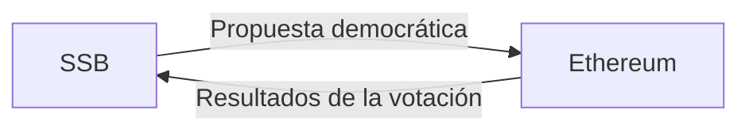

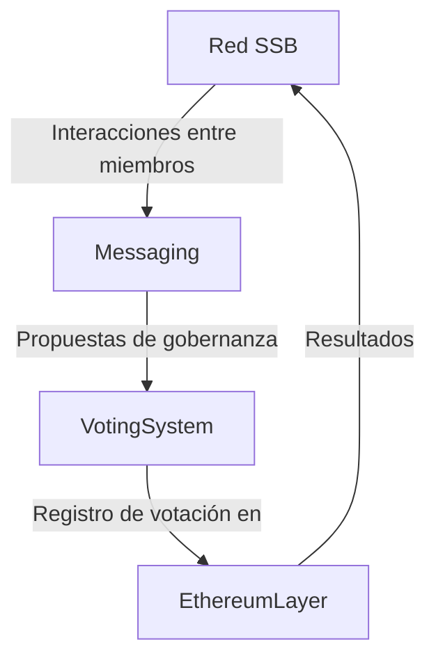

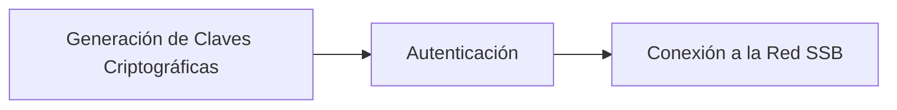

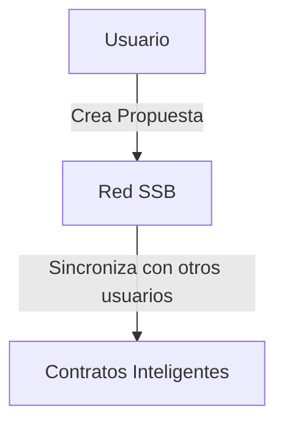

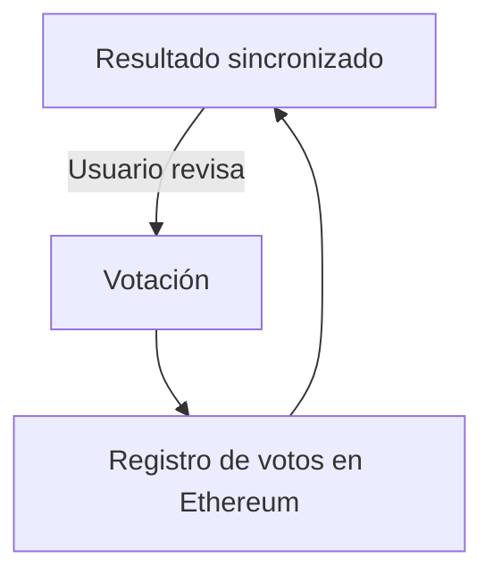

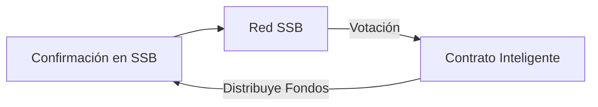

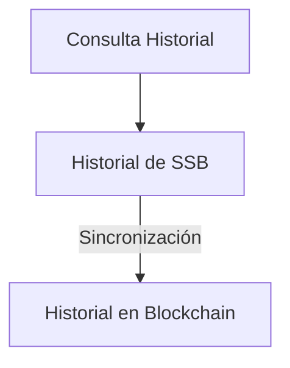

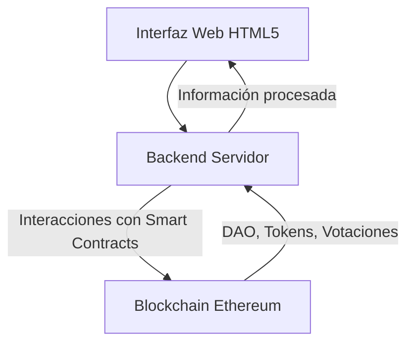

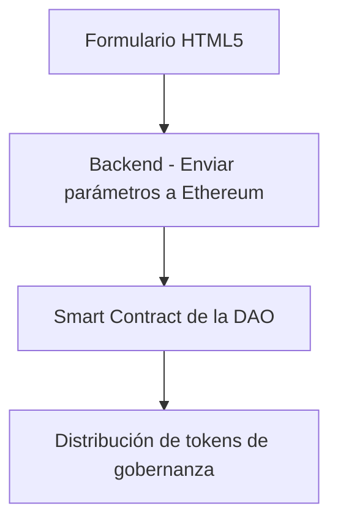

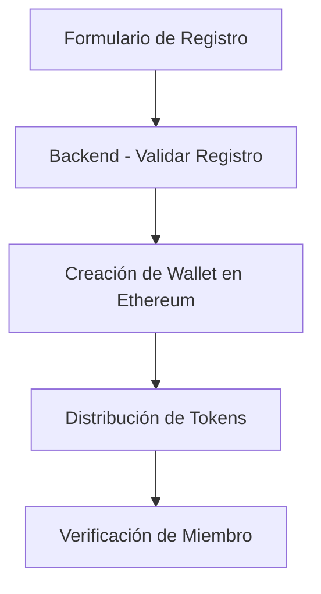

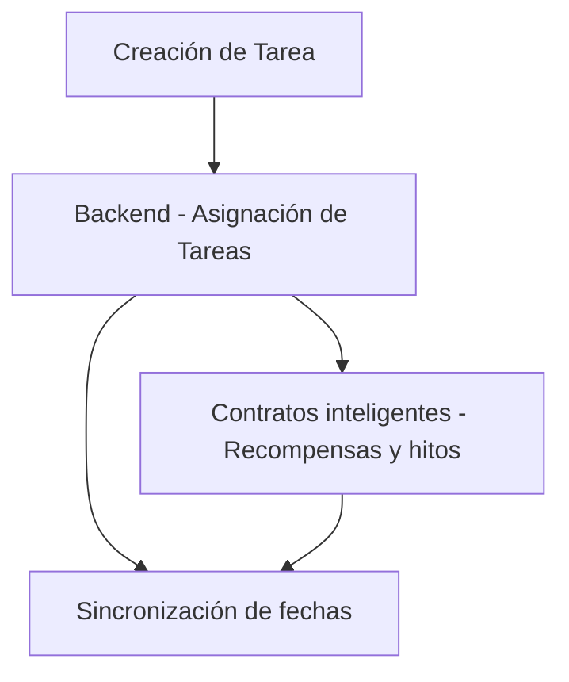

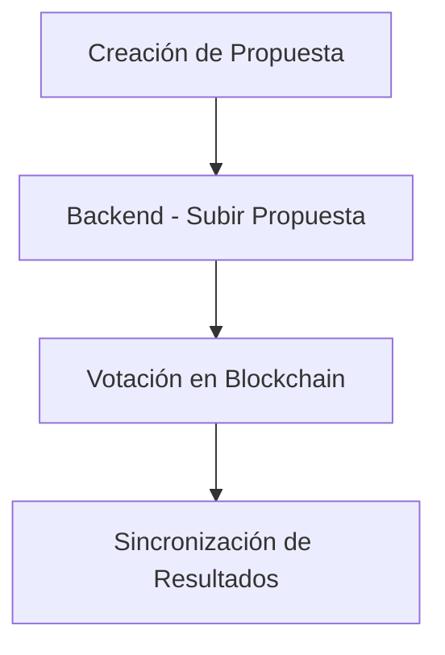

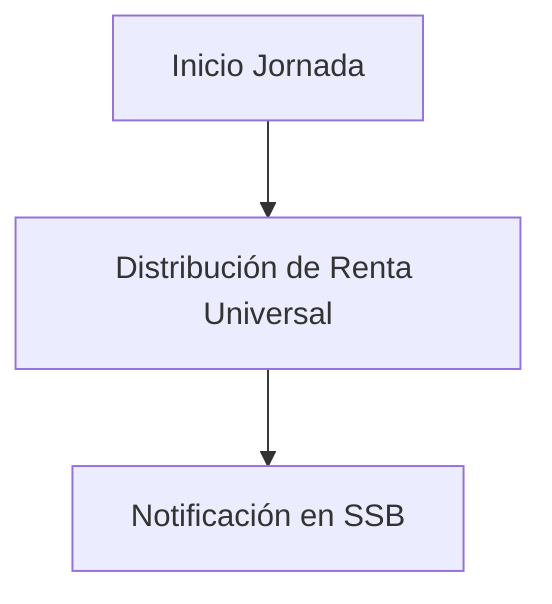

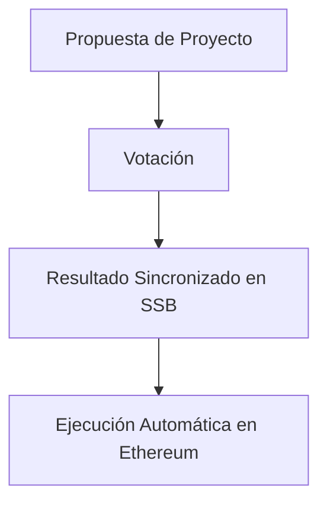

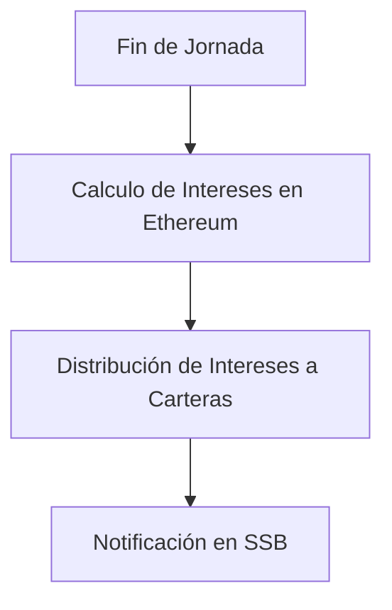


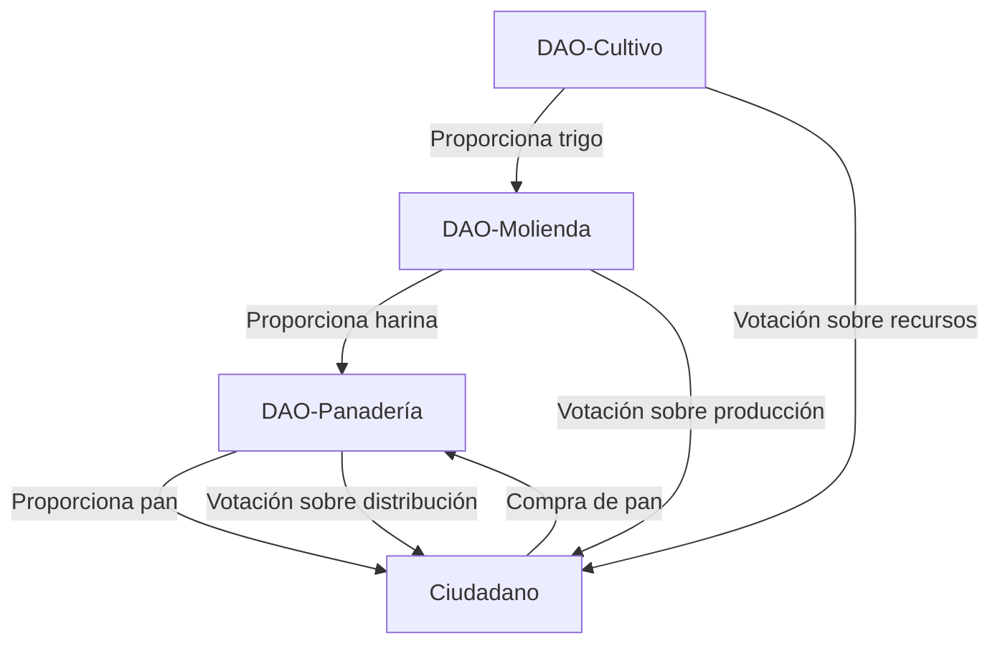